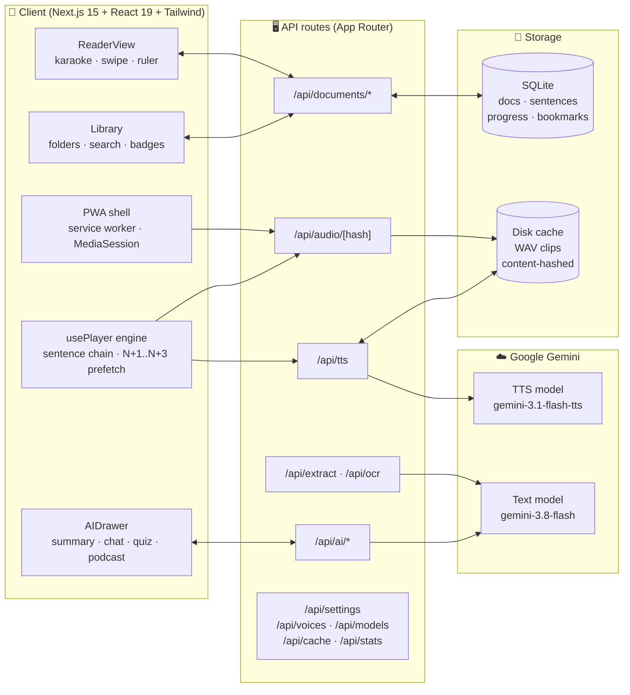

# 🎧 VoxShelf — Listen to Anything

> A **self-hostable, mobile-first text-to-speech reader** powered by **Gemini
> speech generation**. Import PDFs, EPUBs, Word docs, web articles, Google Docs,
> photos of pages, or pasted text — then listen with karaoke-style
> highlighting, lock-screen controls, and an AI reading assistant.

[](https://nextjs.org/)
[](https://react.dev/)
[](https://www.typescriptlang.org/)
[](https://tailwindcss.com/)
[](https://www.docker.com/)
[](https://aistudio.google.com/)
[](https://aistudio.google.com/)
[](https://web.dev/progressive-web-apps/)
[](LICENSE)
[](https://github.com/voxshelf/voxshelf/actions/workflows/ci.yml)

---

## ✨ Features

### 🔊 Listening

- 🎙️ **30 Gemini voices** (Zephyr, Puck, Charon, Kore, Fenrir, … Sulafat) with
  tone badges and adjustable style prompts (“warm bedtime-story voice”).
- ⚡ **0.5×–4.5× speed** with a slider plus one-tap quick pills
  (`0.75x 1.0x 1.25x 1.5x 1.75x 2.0x 2.5x`).
- 🎛️ **Zero-latency engine**: the next 3 sentences pre-buffer during playback
  so narration never pauses between sentences.
- ⏮️ **±15s skip**, sentence prev/next, sleep timer (5–60 min or end of
  document), full-document WAV download.
- 📱 **Background & lock-screen playback** via the MediaSession API — keeps
  playing with the screen off, with transport controls on the lock screen.

### 📖 Karaoke reader

- 🟡 **Word-level karaoke tracking** with a glowing active sentence and your
  choice of 6 cursor colors.
- 📜 **Non-fighting auto-scroll** — manual scrolling pauses follow mode for
  4 seconds, then resumes.
- 👆 **Swipe gestures**: swipe left/right on the article to step sentences.
- 🔦 **Reading ruler / focus-line mode** that dims surrounding text, plus a
  focus mask and bionic-reading fixation view.
- 🔤 **Dyslexia-friendly typography**: OpenDyslexic-first stack with Atkinson
  Hyperlegible fallback, plus Sans/Serif/Mono, adjustable size and line height.
- 🖍️ **Highlights & notes**: select any passage, pick a color, attach a note;
  copy everything with surrounding context or export to Markdown.
- 🔖 **Bookmarks**, per-sentence click-to-play, timeline scrubber with hover
  previews and time-left estimates.

### 🤖 AI assistant

- 📝 **One-click summaries** (short/detailed, map-reduce so full books work).
- 💡 **Instant explainer** for any selected text, with surrounding sentences
  as context.
- 💬 **In-context document chat**: multi-turn Q&A grounded in the document,
  with suggested prompts and 1-click spoken answers.
- 🧠 **Quiz & flashcards**: AI-generated multiple-choice quizzes with live
  scoring plus 3D flip-cards for active recall.
- 🎙️ **Multi-voice podcast generator**: turns any document into a lively
  2-host episode (Alex & Sam) stitched into one audio file.
- 🎤 **Voice dictation & AI cleanup**: live microphone speech-to-text with
  filler-word removal and punctuation formatting.

### 📚 Library & storage

- 🗂️ **Folders, tags, search, sort, archive**, grid/list views, per-document
  export (TXT/MD), reading-progress badges.
- 💾 **SQLite persistence** for documents, sentences, progress, bookmarks,
  highlights, podcasts, pronunciations, settings, and the audio-cache index.
- 🔁 **Disk audio cache**: every sentence is synthesized once (content-hashed
  by text + voice + style) and reused forever — re-listening is free.
- 📴 **True offline mode**: download books to the device; reading, listening,
  and the library keep working with no network.
- 🔊 **Pronunciation dictionary**: fix how names and tricky words are spoken
  everywhere.
- 📊 **Reading stats**: streaks, words read, listening history.

### 📲 Mobile-first & PWA

- 👆 **44×44px thumb-friendly tap targets** throughout the player, library,
  and reader.
- 📳 Haptic feedback on transport controls, safe-area insets for notched
  phones, installable PWA with offline service worker and app shortcuts.

## 🖼️ Screenshots (what you’ll see)

> Drop real screenshots into `docs/screenshots/` and link them here. Suggested
> layout:

| Library | Karaoke reader | AI assistant |
| ------- | -------------- | ------------ |
| Header with the VoxShelf mark, green “API ready” pill, theme toggle, settings gear and Import button; document cards with source badges (PDF, EPUB, Article, Scan…), word counts, tag chips, emerald progress bars and Resume/Export/Archive/Delete actions; search, sort, tag filters and grid/list toggle above. | The active sentence glows amber with the current word highlighted, neighbors dimmed in ruler mode; font panel (Sans/Serif/Mono/Dyslexia-friendly, size, line height); floating bottom player with animated equalizer, transport controls, speed pills, 30-voice selector with tone badge, style prompt, sleep timer and audio download. | Bottom sheet (mobile) / side drawer (desktop) with Summary / Explain / Chat / Quiz / Cards / Podcast / Saved / Highlights tabs; 3D flip flashcards; podcast player with per-speaker transcript. |

```
docs/
  screenshots/
    library.png    # grid of document cards + folder pills
    reader.png     # karaoke highlight + player bar
    ai-drawer.png  # assistant sheet with tabs
    mobile.png     # phone frame: bottom sheet + equalizer
```

## 🚀 Quick start (local)

Prerequisites: Node.js 20+ (22+ recommended).

```bash
git clone https://github.com/voxshelf/voxshelf.git
cd voxshelf
npm install
cp .env.example .env   # then add your GEMINI_API_KEY
npm run dev
```

Open [http://localhost:38492](http://localhost:38492). On first run a `./data`
directory is created holding `voxshelf.db` (SQLite) and the `audio/` cache.

Get a free Gemini API key at <https://aistudio.google.com/apikey> and either
set `GEMINI_API_KEY` in `.env` or paste it into **Settings** in the app (the
in-app key overrides the environment variable).

Production build:

```bash
npm run build
npm start
```

## 🐳 Quick start (Docker)

```bash
export GEMINI_API_KEY=AIza…   # or create a .env file with it
docker compose up --build -d
```

Then open [http://localhost:38492](http://localhost:38492). Library data and
the audio cache persist in the local `./data` volume. To update:

```bash
docker compose pull   # if using a published image
docker compose up --build -d
```

The Compose file maps container port `38492` to host port `38492`:

```yaml
services:
  voxshelf:
    build: .
    ports:
      - "38492:38492"
    environment:
      - GEMINI_API_KEY=${GEMINI_API_KEY:-}
      - DATA_DIR=/app/data
    volumes:
      - ./data:/app/data
    restart: unless-stopped
```

Plain `docker run` equivalent:

```bash
docker build -t voxshelf:latest .
docker run -d --name voxshelf --restart unless-stopped \
  -p 38492:38492 \
  -e GEMINI_API_KEY=AIza… \
  -v ./data:/app/data \
  voxshelf:latest
```

Prebuilt multi-arch images (`linux/amd64` + `linux/arm64`) publish to GHCR
on every release — see [docs/SERVER.md](docs/SERVER.md) for run, update,
backup/restore, and safe-exposure guides. Set `API_KEY` to lock the server
behind an unlock screen (empty = open, fine on a trusted LAN).

## 🖥️ Desktop apps & sync

Native **macOS, Windows, and Linux** apps ship from every
[GitHub release](https://github.com/voxshelf/voxshelf/releases).
Each app embeds the full server with a local SQLite library, so it works
offline — and it can two-way sync with your Docker server (or another
device) via **Settings → Library sync**.

### Install

| OS | Download | Steps |
| --- | --- | --- |
| macOS (Apple Silicon) | `VoxShelf-*-arm64.dmg` | Open the DMG, drag to Applications. First launch: right-click → Open → Open (builds are unsigned). |
| macOS (Intel) | `VoxShelf-*.dmg` (no `arm64` in the name) | Same as above. |
| Windows 10+ | `VoxShelf Setup *.exe` | Run the installer. If SmartScreen warns: More info → Run anyway. |
| Linux | `VoxShelf-*.AppImage` | `chmod +x VoxShelf-*.AppImage`, then run it. No install needed. |

### First run

1. Open VoxShelf and go to **Settings**.
2. Add your Gemini API key ([free](https://aistudio.google.com/apikey)) — TTS and AI features need it.
3. (Optional) To sync with a home server, enter its URL under **Settings → Library sync** (e.g. `http://192.168.1.10:38492`) and save. The first sync runs immediately, then about once a minute.

### What syncs

- Syncs documents, reading progress, bookmarks, highlights, folders,
  podcast scripts, settings, pronunciation rules, and reading stats.
- Last-write-wins conflicts, delete propagation, background + on-demand
  cycles — details in [docs/SYNC.md](docs/SYNC.md).
- Audio cache and API keys stay per-device; sync is plain HTTP, so keep it
  on a trusted LAN/VPN.

### Data locations

| OS | Library (SQLite + audio cache) |
| --- | --- |
| macOS | `~/Library/Application Support/VoxShelf/voxshelf-data/` |
| Windows | `%APPDATA%\VoxShelf\voxshelf-data\` |
| Linux | `~/.config/VoxShelf/voxshelf-data/` |

Back up that folder to back up everything (**Help → Open data folder**
jumps there). Full detail: [docs/DESKTOP.md](docs/DESKTOP.md),
[docs/SERVER.md](docs/SERVER.md).

## 🏠 Self-hosting guides

All guides assume the app listens on port `38492` internally.

### Unraid

1. Open the **Docker** tab → **Add Container**.
2. Set **Repository** to your VoxShelf image (or build from this repo), and
   add a port mapping `38492` → `38492` (TCP).
3. Add a path mapping: container `/app/data` → host
   `/mnt/user/appdata/voxshelf`.
4. Add a variable `GEMINI_API_KEY` with your key.
5. Click **Apply**, then open `http://<unraid-ip>:38492`.

### TrueNAS SCALE

1. Go to **Apps** → **Discover** → **Custom App** (or use the Docker Compose
   custom-app support) and paste the contents of `docker-compose.yml`.
2. Change the volume to a dataset path, e.g.
   `/mnt/tank/apps/voxshelf:/app/data`.
3. Set `GEMINI_API_KEY` in the environment section and expose port `38492`.
4. Deploy and open `http://<truenas-ip>:38492`.

### Synology DSM

1. Open **Container Manager** → **Project** → **Create**, and paste the
   `docker-compose.yml` contents.
2. Set the volume path to a folder on your volume, e.g.
   `/volume1/docker/voxshelf:/app/data`.
3. Add `GEMINI_API_KEY` under environment variables.
4. Build/start the project, then open `http://<nas-ip>:38492`. For HTTPS,
   put it behind a DSM reverse proxy (Control Panel → Login Portal →
   Advanced) with a free Let’s Encrypt certificate.

### Railway

1. Push this repo to GitHub, then **New Project** → **Deploy from Repo** in
   Railway.
2. Set the `GEMINI_API_KEY` variable in the service settings.
3. Add a volume mounted at `/app/data` so the library and audio cache survive
   redeploys.
4. Railway assigns a public `https://…` domain automatically — no port config
   needed (the container listens on `38492`; Railway routes to it).

### Fly.io

```bash
fly launch            # accept the detected Dockerfile; set internal port 38492
fly volumes create voxshelf_data --size 3 --region <your-region>
fly secrets set GEMINI_API_KEY=AIza…
fly deploy
```

Make sure `fly.toml` mounts the volume at `/app/data`:

```toml
[mounts]
  source = "voxshelf_data"
  destination = "/app/data"

[[services]]
  internal_port = 38492
```

### Cloudflare Tunnel (expose your home server securely)

No open ports needed — traffic flows outbound through `cloudflared`:

```bash
cloudflared tunnel create voxshelf
cloudflared tunnel route dns voxshelf listen.example.com
```

`~/.cloudflared/config.yml`:

```yaml
tunnel: <tunnel-id>
credentials-file: /home/user/.cloudflared/<tunnel-id>.json

ingress:
  - hostname: listen.example.com
    service: http://localhost:38492
  - service: http_status:404
```

```bash
cloudflared tunnel run voxshelf
```

Then open `https://listen.example.com` — HTTPS is handled by Cloudflare, and
you can add Access (SSO) rules in the Zero Trust dashboard.

## ⚙️ Configuration

| Variable            | Default                          | Description                                     |
| ------------------- | -------------------------------- | ----------------------------------------------- |
| `GEMINI_API_KEY`    | —                                | Gemini API key (can also be set in-app)         |
| `GEMINI_TTS_MODEL`  | `gemini-3.1-flash-tts-preview`   | Speech synthesis model (overridable in-app)     |
| `GEMINI_TEXT_MODEL` | `gemini-3.8-flash`               | Summary/explain/chat/OCR model (in-app too)     |
| `DATA_DIR`          | `./data` (`/app/data` in Docker) | SQLite db + audio cache location                |
| `DB_PATH`           | `$DATA_DIR/voxshelf.db`         | SQLite file path                                |
| `PORT`              | `38492`                          | HTTP port                                       |

Model names are configurable because Google iterates on preview model IDs —
if a default stops resolving, point it at the current preview model in
Settings (or **Fetch Live Models**) without redeploying.

## 📲 PWA installation

VoxShelf is a fully installable Progressive Web App (standalone display,
offline service worker, Library/Upload shortcuts).

**iPhone / iPad (Safari):**

1. Open your VoxShelf URL in Safari.
2. Tap **Share** → **Add to Home Screen**.
3. Tap **Add**. VoxShelf launches full-screen like a native app, with
   background audio and lock-screen controls.

**Android (Chrome):**

1. Open your VoxShelf URL in Chrome.
2. Tap the ⋮ menu → **Install app** (or **Add to Home screen**).
3. Confirm **Install**. The app appears in your drawer with its own icon and
   splash screen.

> Tip: for the best mobile experience, serve VoxShelf over HTTPS (required
> for install prompts and the offline service worker on most browsers).

## 🏗️ Architecture



### How it works

- **Import** (`/api/extract`, `/api/ocr`): files/URLs are converted to clean
  text (pdf-parse, mammoth, EPUB spine parsing, Readability, Tesseract /
  Gemini Vision), optionally AI-cleaned, then stored with per-sentence offsets.
- **Speech** (`/api/tts`): each sentence is hashed with its voice + style
  prompt; cache hits stream instantly from `/api/audio/[hash]`, misses are
  synthesized with Gemini TTS (long sentences are chunked and stitched into
  one WAV) and stored in SQLite + on disk.
- **Playback**: the client chains per-sentence audio through one element,
  prefetches the next 3 sentences, maps elapsed time to word highlights, and
  publishes metadata + transport handlers to the OS via MediaSession.
- **AI** (`/api/ai/*`): summaries use map-reduce so full books work; the
  explainer and chat use surrounding sentences as grounding context.

### Project layout

```
src/
  app/            Next.js App Router: pages + API routes
  components/     Library, ImportModal, ReaderView, PlayerBar, AIDrawer, …
  hooks/          usePlayer (sentence-chained playback engine)
  lib/            db, settings, gemini, tts, audio cache, documents,
                  extract/ (pdf, docx, epub, text, url, ocr), voices, text
data/             voxshelf.db + audio/ cache (created at runtime, git-ignored)
Dockerfile        multi-stage production image (standalone output)
docker-compose.yml  app + persistent ./data volume
```

### Database schema

SQLite (`better-sqlite3`, with automatic fallback to Node’s built-in
`node:sqlite`):

- **documents** — title, author, source, full text, counts, voice/style/speed,
  tags, reading progress, archive flag, timestamps.
- **sentences** — `(doc_id, idx)` text + char offsets + linked audio hash.
- **audio_cache** — content-hash → voice/style, file path, bytes, duration,
  usage stats (LRU-friendly).
- **bookmarks** — sentence anchors + notes.
- **highlights** — sentence anchors + quoted text + color + notes.
- **podcasts** — generated episodes + stitched audio.
- **folders / pronunciations / settings** — organization, TTS overrides, app
  config.

## 📡 REST API reference

Base URL: `http://localhost:38492`. All bodies are JSON unless noted.
Errors return `{ "error": "<message>" }` with an appropriate status code.

### Speech & audio

| Route               | Method | Purpose                                            |
| ------------------- | ------ | -------------------------------------------------- |
| `/api/tts`          | POST   | Synthesize text → `{ url, hash, durationMs }`      |
| `/api/audio/[hash]` | GET    | Stream a cached WAV (immutable, cacheable)         |

`POST /api/tts` body:

```json
{
  "text": "Hello world.",
  "voice": "Kore",
  "stylePrompt": "warm bedtime-story voice"
}
```

### Documents & library

| Route                                     | Method(s)       | Purpose                                             |
| ----------------------------------------- | --------------- | --------------------------------------------------- |
| `/api/documents`                          | GET / POST      | List (see filters) / create a document              |
| `/api/documents/[id]`                     | GET/PATCH/DELETE| Detail (sentences+bookmarks+highlights) / update    |
| `/api/documents/[id]/audio`               | GET             | Whole document as one WAV (`?download=1` to save)   |
| `/api/documents/[id]/bookmarks`           | GET / POST      | List / add a bookmark                               |
| `/api/documents/[id]/bookmarks/[bid]`     | DELETE          | Remove a bookmark                                   |
| `/api/documents/[id]/highlights`          | GET / POST      | List / add a highlight + note                       |
| `/api/documents/[id]/highlights/[hid]`    | PATCH / DELETE  | Edit note/color / remove a highlight                |
| `/api/documents/[id]/prerender`           | GET / POST      | Cache-coverage stats / pre-render audio             |
| `/api/folders`                            | GET / POST      | List / create folders                               |
| `/api/folders/[id]`                       | DELETE          | Delete a folder (docs become unfiled)               |

`GET /api/documents` query params: `q` (search), `tag`, `sort`
(`updated`/`created`/`title`/`progress`), `archived=1`, `folder=<id|unfiled>`.

`PATCH /api/documents/[id]` accepts partial fields: `title`, `author`,
`voice`, `stylePrompt`, `speed`, `tags`, `folderId`, `isArchived`,
`progressSentenceIndex`, `progressCharOffset`.

### Import & OCR

| Route          | Method         | Purpose                                         |
| -------------- | -------------- | ----------------------------------------------- |
| `/api/extract` | POST (multipart) | File (PDF/EPUB/DOCX/TXT/MD/image) or URL → text |
| `/api/ocr`     | POST (multipart) | Image → OCR text (`engine`: `ai` or `local`)    |

### AI

| Route              | Method | Purpose                                              |
| ------------------ | ------ | ---------------------------------------------------- |
| `/api/ai/summary`  | POST   | Document summary (`{ documentId, length }`)          |
| `/api/ai/explain`  | POST   | Explain selected text (`{ text, context }`)          |
| `/api/ai/chat`     | POST   | Grounded Q&A (`{ documentId, messages, userQuestion }`) |
| `/api/ai/quiz`     | POST   | Quiz + flashcards (`{ documentId }`)                 |
| `/api/ai/podcast`  | GET/POST | List episodes / generate 2-host episode            |
| `/api/ai/cleanup`  | POST   | Fix OCR/extraction artifacts (`{ text }`)            |
| `/api/ai/transcribe` | POST (multipart) | Microphone audio → cleaned transcript         |

### Settings, voices & stats

| Route                  | Method(s)    | Purpose                                            |
| ---------------------- | ------------ | -------------------------------------------------- |
| `/api/voices`          | GET          | All 30 voices + default                            |
| `/api/models`          | GET          | TTS/text model lists (`?key=` overrides lookup key)|
| `/api/settings`        | GET / PUT    | Public settings (key never exposed) / update       |
| `/api/pronunciations`  | GET/POST/DELETE | Pronunciation dictionary entries                |
| `/api/cache`           | GET / DELETE | Audio-cache stats / clear                          |
| `/api/stats`           | GET          | Reading stats, streaks, history                    |
| `/api/stats/session`   | POST         | Record a reading session (`{ docId, ... }`)        |
| `/api/data/export`     | GET          | Full library backup (JSON)                         |
| `/api/data/import`     | POST         | Restore a backup (JSON)                            |

### Sync & health

| Route                  | Method(s)    | Purpose                                            |
| ---------------------- | ------------ | -------------------------------------------------- |
| `/api/sync/pull`       | POST         | Rows newer than cursors (`{ v, cursors, tables? }`)|
| `/api/sync/push`       | POST         | Idempotent LWW merge (`{ v, changes, tombstones }`)|
| `/api/sync/status`     | GET          | Local sync config + last-cycle summary             |
| `/api/sync/config`     | POST         | Set server URL / enabled (`{ serverUrl, enabled }`)|
| `/api/sync/now`        | POST         | Run one push/pull cycle now                        |
| `/api/sync/library`    | GET          | Lightweight server catalog (titles, no text)       |
| `/api/sync/fetch`      | POST         | Full rows for explicit doc ids (`{ v, ids }`)      |
| `/api/sync/download`   | POST         | Pull docs/folders from peer here                   |
| `/api/sync/remove`     | POST         | Delete from this device only (peer keeps them)     |
| `/api/auth/status`     | GET          | Lock state (`{ locked, authed }`, always open)     |
| `/api/auth/login`      | POST         | Unlock with key (`{ key }` → httpOnly cookie)      |
| `/api/auth/logout`     | POST         | Clear this browser's access                        |
| `/api/health`          | GET          | Liveness probe (`{ ok, version, engine, time }`)   |

## ⌨️ Keyboard shortcuts

Press `?` anywhere in the app to open the cheat sheet.

### Playback & navigation

| Keys            | Action                 |
| --------------- | ---------------------- |
| `Space`         | Play / pause           |
| `←` / `→`       | Previous / next sentence |
| `Shift` + `←`/`→` | Skip ∓15 seconds     |
| `↑` / `↓`       | Speed +0.1× / −0.1×    |

### Reading & study tools

| Keys  | Action                                  |
| ----- | --------------------------------------- |
| `R`   | Toggle reading ruler                    |
| `B`   | Bookmark current sentence               |
| `A`   | Open AI assistant                       |
| `P`   | Generate / open AI podcast              |
| `?`   | Toggle shortcuts help                   |
| `Esc` | Close modals and drawers                |

## 🤝 Contributing

See [CONTRIBUTING.md](CONTRIBUTING.md) for the dev setup, coding conventions,
and PR process — and our [Code of Conduct](CODE_OF_CONDUCT.md).

```bash
npm run typecheck   # must pass
npm run build       # must pass
```

## 📝 Notes & limits

- TTS, AI summary/explain/chat/quiz/podcast and Vision OCR require a Gemini
  API key; on-device Tesseract OCR, the library, and cached-audio playback
  work without one.
- First on-device OCR run downloads Tesseract language data (~12 MB) and is
  slower; results improve dramatically with the AI engine.
- Google Docs import needs “Anyone with the link can view” sharing.
- Browsers require a user tap before audio starts; after that, background and
  lock-screen playback work via MediaSession.

## 📄 License

MIT — see [LICENSE](LICENSE).
