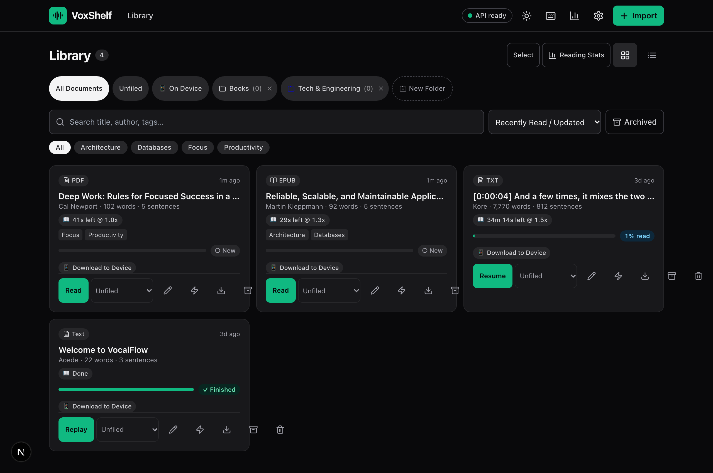
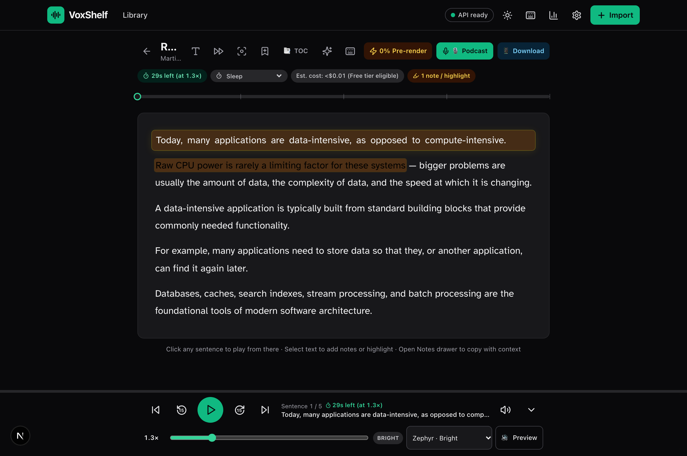
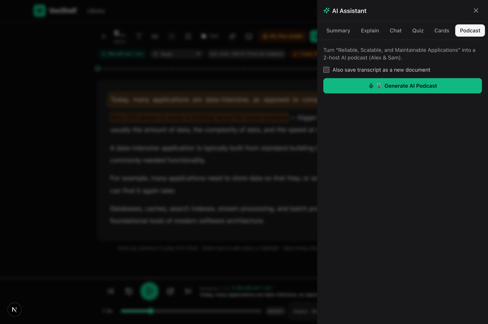
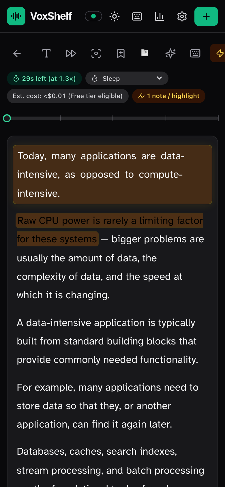
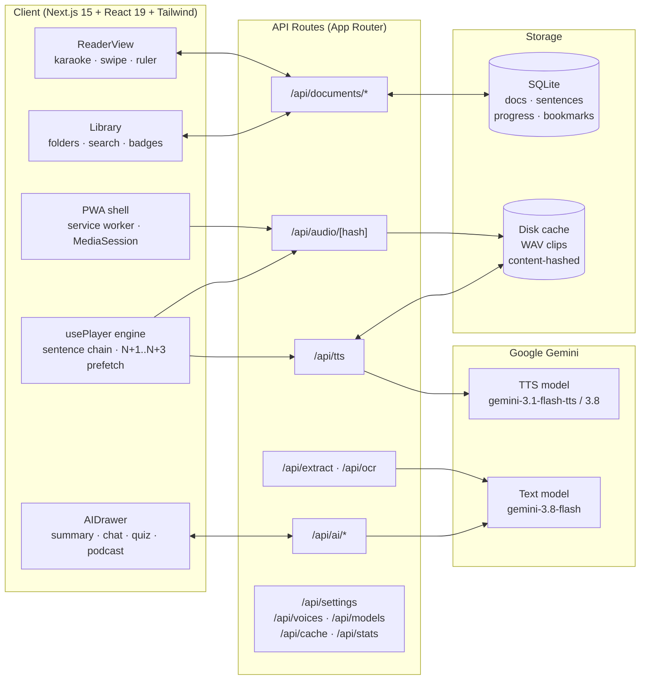

# VoxShelf

> A self-hostable, mobile-ready text-to-speech reader powered by Gemini speech generation — built as an open, private alternative to expensive reading subscriptions.
> Import PDFs, EPUBs, Word documents, web articles, Google Docs, book photos, or raw text, then listen with karaoke-style highlighting, dyslexia-friendly typography, lock-screen controls, and an AI reading assistant.

[](https://nextjs.org/)
[](https://react.dev/)
[](https://www.typescriptlang.org/)
[](https://tailwindcss.com/)
[](https://www.docker.com/)
[](https://aistudio.google.com/)
[](https://aistudio.google.com/)
[](https://web.dev/progressive-web-apps/)
[](LICENSE)
[](https://github.com/techguyowen/voxshelf/actions/workflows/ci.yml)

---

## Why I Built VoxShelf

VoxShelf is an open-source project I vibecoded out of genuine personal need.

Throughout high school and college, I relied heavily on text-to-speech tools to get through mountains of technical documentation, textbooks, research papers, and class assignments. Having dyslexia, listening along while words highlight in sync was often the only way I could stay focused and actually absorb dense material without rereading the same paragraph five times.

Commercial reading apps charge $100 to $250+ every single year for this. That felt unreasonable for something that is essentially an accessibility necessity, especially when you run into arbitrary monthly character caps, subscription fatigue, or locked-down ecosystems.

VoxShelf is designed to solve that:
- **Self-hostable & private:** Run it locally on your laptop, home server, NAS (Unraid, TrueNAS, Synology), or Raspberry Pi.
- **Pennies (or free) with Gemini:** Using your own Gemini API key, speech synthesis with Gemini 3.1 Flash TTS or 3.8 Flash TTS costs pennies a month (or stays entirely within Google's free tier).
- **Built for actual reading:** OpenDyslexic typography, bionic reading fixation, focus rulers, word-by-word karaoke tracking, multi-device sync, and full offline support.

No subscriptions, no artificial paywalls, and no telemetry. Just a fast, reliable reader that gets out of your way.

---

## Features

### Listening & Speech

- **30 Gemini voices:** Zephyr, Puck, Charon, Kore, Fenrir, Aoede, and more, complete with tone indicators and custom style prompts (e.g. "warm conversational tone" or "calm audiobook narrator").
- **Gemini 3.1 and 3.8 Flash TTS support:** Switch between models dynamically in settings or via environment variables.
- **0.5x to 4.5x playback speed:** Fine-grained slider adjustment plus quick-access preset pills (`0.75x`, `1.0x`, `1.25x`, `1.5x`, `1.75x`, `2.0x`, `2.5x`).
- **Zero-latency playback pipeline:** Automatically pre-buffers upcoming sentences so narration flows continuously without pauses between lines.
- **Navigation controls:** ±15-second skip, previous/next sentence jump, sleep timer (5 to 60 minutes or end of document), and single-file WAV audio export.
- **Background & lock-screen playback:** Uses the MediaSession API to keep audio playing with the screen locked, with full transport controls on your mobile lock screen or smartwatch.

### Karaoke Reader

- **Word-level karaoke tracking:** Synchronized active sentence highlighting with 6 customizable cursor themes.
- **Smooth auto-scroll:** Automatically scrolls with playback. Manual scrolling pauses follow-mode for 4 seconds so you can browse freely without being yanked back.
- **Gesture navigation:** Swipe left or right across the screen to step between sentences.
- **Reading focus modes:** Focus ruler to dim surrounding lines, focus mask, and bionic-reading fixation mode.
- **Accessible typography:** OpenDyslexic font stack, Atkinson Hyperlegible fallback, clean modern Sans/Serif/Mono choices, with adjustable font size and line spacing.
- **Highlights & notes:** Select any text passage to highlight in color, add notes, and export your annotations directly to Markdown.
- **Interactive timeline:** Bookmarks, sentence-level tap-to-play, scrub bar with hover previews, and remaining listening time estimates.

### AI Reading Assistant

- **Document summaries:** Quick bullet summaries or detailed multi-section overviews (powered by map-reduce for long books).
- **Instant explainer:** Highlight any difficult sentence or jargon to get a grounded explanation based on the surrounding context.
- **Interactive document chat:** Ask questions directly about the material with answers cited from document passages.
- **Quizzes & flashcards:** Automatically generated multiple-choice comprehension quizzes and 3D flip-cards for active recall.
- **Multi-speaker podcast generator:** Turn documents into conversational 2-host audio episodes (Alex & Sam) stitched into a single downloadable audio file.
- **Dictation & cleanup:** Live voice dictation that uses AI to remove filler words and clean up grammar.

### Library & Organization

- **Flexible organization:** Folders, tags, full-text search, sorting options, and grid/list view toggles.
- **Persistent SQLite storage:** Saves documents, sentences, progress cursors, bookmarks, notes, pronunciations, and audio index.
- **Content-addressed disk cache:** Sentences are hashed by text, voice, and style parameters. Re-listening to already generated text is instantaneous and consumes zero API calls.
- **Offline mode:** Download documents to your device for completely network-free reading and listening via client-side indexed storage.
- **Pronunciation dictionary:** Set custom phonetic substitutions for unusual acronyms, technical terms, and proper nouns.
- **Reading statistics:** Track listening streaks, total words digested, and historical reading sessions.

### Mobile-Ready & PWA

- **Touch-optimized:** 44px minimum tap targets across all player controls, dialogs, and reader actions.
- **Native mobile ergonomics:** Haptic feedback on controls, safe-area inset padding for notched phones, and full PWA installation support.

---

## Screenshots

| Shelf & Library | Karaoke Reader |
| :---: | :---: |
|  |  |

| AI Assistant Drawer | Mobile Reader View |
| :---: | :---: |
|  |  |

---

## Getting Started

### Local Development

Prerequisites: Node.js 20+ (Node 22 recommended).

```bash
git clone https://github.com/techguyowen/voxshelf.git
cd voxshelf
npm install
cp .env.example .env   # add your GEMINI_API_KEY
npm run dev
```

Open [http://localhost:38492](http://localhost:38492) in your browser.

Get a free Gemini API key from [Google AI Studio](https://aistudio.google.com/apikey). You can place it in your `.env` file or enter it directly into the in-app Settings modal.

To build and run for production:

```bash
npm run build
npm start
```

---

## Docker Setup

### Docker Compose

```bash
export GEMINI_API_KEY=AIza…   # or place in a .env file
docker compose up --build -d
```

Open [http://localhost:38492](http://localhost:38492). Library data and audio cache are persisted to the local `./data` folder.

To update:

```bash
docker compose pull
docker compose up --build -d
```

### Plain Docker Run

```bash
docker build -t voxshelf:latest .
docker run -d --name voxshelf --restart unless-stopped \
  -p 38492:38492 \
  -e GEMINI_API_KEY=AIza… \
  -v ./data:/app/data \
  voxshelf:latest
```

---

## Desktop Apps & Sync

Native installers for **macOS, Windows, and Linux** are available under [Releases](https://github.com/techguyowen/voxshelf/releases).

Each desktop app embeds the full reader and local database for offline use, and can two-way sync with your central Docker server or other devices via **Settings → Library sync**.

### Installation

| Operating System | File | Notes |
| ---------------- | ---- | ----- |
| macOS (Apple Silicon) | `VoxShelf-*-arm64.dmg` | Open DMG, drag to Applications. First launch: right-click → Open. |
| macOS (Intel) | `VoxShelf-*.dmg` | Open DMG, drag to Applications. |
| Windows 10/11 | `VoxShelf Setup *.exe` | Run installer. If SmartScreen appears: More info → Run anyway. |
| Linux | `VoxShelf-*.AppImage` | Make executable (`chmod +x`) and launch. |

### Syncing Devices

1. Open VoxShelf on your desktop or secondary device and go to **Settings**.
2. Under **Library sync**, enter the URL of your primary instance (e.g. `http://192.168.1.50:38492`) and save.
3. Sync runs immediately and then periodically in the background (last-write-wins resolution). Details in [docs/SYNC.md](docs/SYNC.md).

---

## Self-Hosting Guides

All guides assume internal port `38492`.

### Unraid

1. Open the **Docker** tab and select **Add Container**.
2. Set **Repository** to `techguyowen/voxshelf:latest` (or build locally).
3. Set port mapping `38492` → `38492` (TCP).
4. Map container path `/app/data` to host path `/mnt/user/appdata/voxshelf`.
5. Add variable `GEMINI_API_KEY` with your API key.
6. Click **Apply** and access via `http://<unraid-ip>:38492`.

### TrueNAS SCALE

1. Navigate to **Apps** → **Discover** → **Custom App** and use the `docker-compose.yml` template.
2. Map `/app/data` to a storage dataset (e.g. `/mnt/tank/apps/voxshelf:/app/data`).
3. Set `GEMINI_API_KEY` in environment variables and expose port `38492`.
4. Deploy and navigate to `http://<truenas-ip>:38492`.

### Synology DSM

1. Open **Container Manager** → **Project** → **Create**, and paste the contents of `docker-compose.yml`.
2. Map `/app/data` to a folder on your volume (e.g. `/volume1/docker/voxshelf:/app/data`).
3. Set `GEMINI_API_KEY` in environment variables.
4. Launch the project and browse to `http://<nas-ip>:38492`.

### Railway / Cloud Deployment

1. Fork or push this repository to GitHub, then click **New Project** → **Deploy from GitHub repo** in Railway.
2. Set `GEMINI_API_KEY` in environment variables.
3. Add a persistent volume mounted at `/app/data`.
4. Railway routes public traffic automatically to internal port `38492`.

### Cloudflare Tunnel (Remote Access)

Expose your local instance securely without opening inbound ports:

```bash
cloudflared tunnel create voxshelf
cloudflared tunnel route dns voxshelf listen.yourdomain.com
```

In `~/.cloudflared/config.yml`:

```yaml
tunnel: <tunnel-id>
credentials-file: /home/user/.cloudflared/<tunnel-id>.json

ingress:
  - hostname: listen.yourdomain.com
    service: http://localhost:38492
  - service: http_status:404
```

Run tunnel:

```bash
cloudflared tunnel run voxshelf
```

---

## Configuration

| Variable | Default | Description |
| -------- | ------- | ----------- |
| `GEMINI_API_KEY` | — | Gemini API key (can also be configured in-app). |
| `GEMINI_TTS_MODEL` | `gemini-3.1-flash-tts-preview` | Speech synthesis model (`gemini-3.1-flash-tts-preview` or `gemini-3.8-flash-tts-preview`). |
| `GEMINI_TEXT_MODEL` | `gemini-3.8-flash` | Text generation and OCR model (`gemini-3.8-flash` or `gemini-2.5-flash`). |
| `DATA_DIR` | `./data` (`/app/data` in Docker) | Directory for SQLite database and cached audio files. |
| `DB_PATH` | `$DATA_DIR/voxshelf.db` | Explicit SQLite database file location. |
| `PORT` | `38492` | HTTP listening port. |
| `API_KEY` | — | Optional password protection for your instance. |

---

## PWA Installation

VoxShelf can be installed directly to your home screen or desktop as a standalone app.

**iOS / iPadOS (Safari):**
1. Open your VoxShelf URL in Safari.
2. Tap the **Share** icon and select **Add to Home Screen**.
3. Tap **Add**. VoxShelf opens in standalone view with background audio support.

**Android (Chrome):**
1. Open your VoxShelf URL in Chrome.
2. Tap the menu (⋮) and select **Install app** (or **Add to Home screen**).
3. Confirm installation.

---

## Architecture



### Pipeline Overview

- **Document Ingestion:** Text extraction supports PDF, EPUB, DOCX, TXT, Markdown, web URLs (Readability), and image OCR (Tesseract or Gemini Vision). Extracted text is segmented into sentence boundaries with accurate character offsets.
- **Audio Synthesis & Caching:** Each sentence is synthesized through Gemini Flash TTS using its text and voice style parameters. Generated audio is cached as WAV files indexed by content hash. Subsequent listens to the same sentence are served directly from disk.
- **Sentence Chaining:** The frontend playback engine pre-fetches upcoming sentence clips, dynamically maps audio playback position to word boundaries for karaoke tracking, and updates system MediaSession handlers.

---

## REST API Reference

Base URL: `http://localhost:38492`. Responses return standard JSON with HTTP error codes on failure.

### Audio & Synthesis

| Route | Method | Purpose |
| ----- | ------ | ------- |
| `/api/tts` | POST | Synthesizes sentence text → returns `{ url, hash, durationMs }`. |
| `/api/audio/[hash]` | GET | Streams cached immutable WAV clip. |

Example `POST /api/tts` payload:

```json
{
  "text": "The quick brown fox jumps over the lazy dog.",
  "voice": "Kore",
  "stylePrompt": "calm, natural audiobook tone"
}
```

### Documents & Library

| Route | Method | Purpose |
| ----- | ------ | ------- |
| `/api/documents` | GET / POST | List documents with query filters, or create a new entry. |
| `/api/documents/[id]` | GET / PATCH / DELETE | Fetch full document, update metadata/progress, or delete. |
| `/api/documents/[id]/audio` | GET | Stream or download concatenated full-document audio. |
| `/api/documents/[id]/bookmarks` | GET / POST | Retrieve or add sentence bookmarks. |
| `/api/documents/[id]/highlights` | GET / POST | Retrieve or add colored highlights and notes. |
| `/api/documents/[id]/prerender` | GET / POST | Inspect audio cache coverage or trigger background pre-render. |
| `/api/folders` | GET / POST | Manage organizational folders. |

### Ingestion & AI

| Route | Method | Purpose |
| ----- | ------ | ------- |
| `/api/extract` | POST (multipart) | Extract structured text from uploaded documents or URLs. |
| `/api/ocr` | POST (multipart) | Run optical character recognition on uploaded images. |
| `/api/ai/summary` | POST | Generate brief or comprehensive document summaries. |
| `/api/ai/explain` | POST | Explain highlighted passages in context. |
| `/api/ai/chat` | POST | Grounded question and answering against document text. |
| `/api/ai/quiz` | POST | Generate comprehension quizzes and flashcards. |
| `/api/ai/podcast` | GET / POST | Generate 2-host conversational podcast episodes. |

### Settings & Utilities

| Route | Method | Purpose |
| ----- | ------ | ------- |
| `/api/voices` | GET | List available voice presets and metadata. |
| `/api/models` | GET | Query supported Gemini TTS and text generation models. |
| `/api/settings` | GET / PUT | Read or update configuration options. |
| `/api/pronunciations` | GET / POST / DELETE | Manage custom pronunciation dictionary substitutions. |
| `/api/stats` | GET | Retrieve reading history and engagement metrics. |
| `/api/health` | GET | Service health probe. |

---

## Keyboard Shortcuts

Press `?` anywhere in the app to view shortcuts.

| Shortcut | Action |
| -------- | ------ |
| `Space` | Play / Pause |
| `←` / `→` | Previous / Next sentence |
| `Shift` + `←` / `→` | Jump backward / forward 15 seconds |
| `↑` / `↓` | Adjust playback speed ±0.1x |
| `R` | Toggle reading focus ruler |
| `B` | Bookmark active sentence |
| `A` | Open AI assistant panel |
| `P` | Open podcast generator |
| `?` | Toggle shortcuts modal |
| `Esc` | Close open drawers and modals |

---

## Contributing

Contributions are welcome. Please read [CONTRIBUTING.md](CONTRIBUTING.md) for local development conventions, styling guides, and pull request workflows.

Before submitting changes, make sure checks pass:

```bash
npm run typecheck
npm run build
```

---

## Notes & Limitations

- Gemini Flash TTS, AI summarization/chat/quizzes, and Vision OCR require a Gemini API key. Basic document reading, on-device Tesseract OCR, and offline playback of cached audio function without an API key.
- Web browsers require a user interaction (such as pressing play) before initializing audio output. Once started, background and lock-screen audio will continue uninterrupted.
- Google Docs import requires links set to "Anyone with the link can view".

---

## License

MIT — see [LICENSE](LICENSE).
